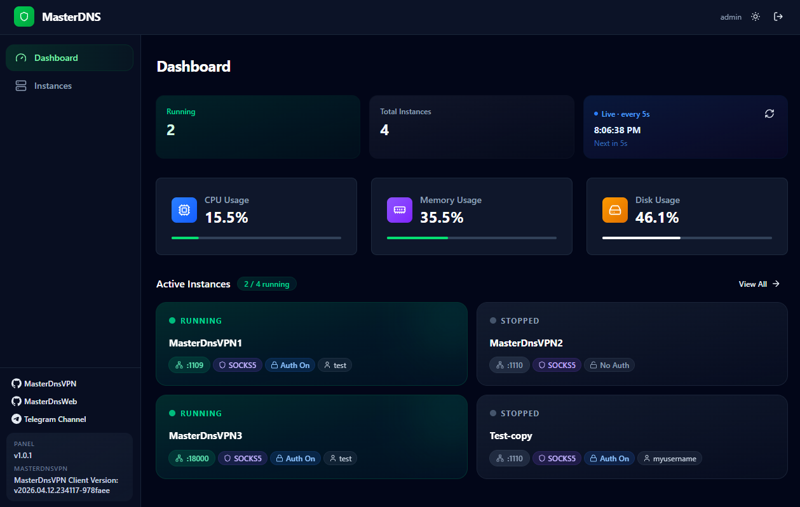
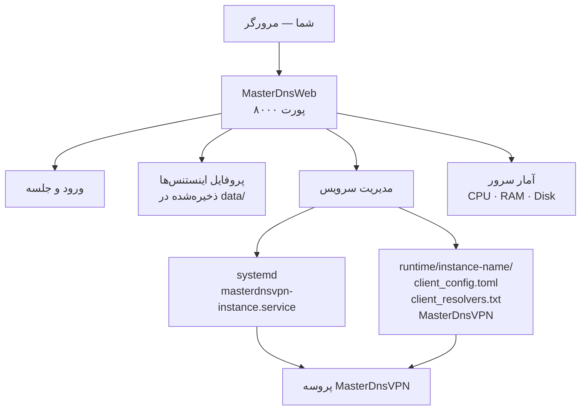

# MasterDnsWeb

[English](README.md)

MasterDnsWeb یک پنل وب برای مدیریت اینستنس‌های **[MasterDnsVPN](https://github.com/masterking32/MasterDnsVPN)** روی سرور لینوکس شماست.
از طریق مرورگر می‌توانید اینستنس‌های VPN را بسازید، تنظیم کنید، راه‌اندازی کنید و متوقف کنید.



> این پروژه در درجه اول برای استفاده روی **سرورهای VPS مستقر در ایران** طراحی شده است.

### پیش‌نیازها

- **Ubuntu 20.04** یا جدیدتر (سایر توزیع‌ها فعلاً پشتیبانی نمی‌شوند)
- فایل فشرده نسخه: `MasterDnsWeb-linux-amd64.tar.gz`
- دسترسی روت (برای مدیریت سرویس‌های سیستم)

---

## نصب

### ۱. استخراج فایل فشرده

```bash
tar -xzf MasterDnsWeb-linux-amd64.tar.gz
cd MasterDnsWeb
```

پس از استخراج، ساختار پوشه به این شکل است:

```
MasterDnsWeb/
  MasterDnsWeb     ← پنل وب (این را اجرا کنید)
  MasterDnsVPN     ← باینری کلاینت VPN
  .env             ← تنظیمات شما
```

### ۲. ویرایش تنظیمات

فایل `.env` را با هر ویرایشگری باز کنید:

```bash
nano .env
```

تنها مواردی که **باید** قبل از راه‌اندازی تغییر دهید:

```env
ADMIN_USERNAME=admin
ADMIN_PASSWORD=changeme   ← یک رمز قوی بگذارید
```

بقیه مقادیر پیش‌فرض امن هستند. ذخیره کنید و ببندید.

### ۳. راه‌اندازی پنل

```bash
sudo ./MasterDnsWeb
```

> **چرا sudo؟** پنل برای ساختن و کنترل سرویس‌های سیستم به دسترسی روت نیاز دارد.

پنل در حال اجراست. مرورگر خود را باز کنید و به آدرس زیر بروید:

```
http://<آی‌پی-سرور-شما>:8000
```

با نام کاربری و رمزی که در `.env` تنظیم کردید وارد شوید.

---

## اجرای خودکار پس از ریبوت (اختیاری)

اگر می‌خواهید پنل بعد از ریست شدن سرور به‌طور خودکار راه‌اندازی شود، یک سرویس سیستم بسازید.

این دستور را اجرا کنید (مسیر `/root/MasterDnsWeb` را با مسیر واقعی پوشه خود جایگزین کنید):

```bash
sudo nano /etc/systemd/system/masterdnsweb.service
```

محتوای زیر را داخل آن بگذارید:

```ini
[Unit]
Description=MasterDnsWeb Panel
After=network.target

[Service]
WorkingDirectory=/root/MasterDnsWeb
ExecStart=/root/MasterDnsWeb/MasterDnsWeb
Restart=always
RestartSec=5
User=root

[Install]
WantedBy=multi-user.target
```

سپس اجرا کنید:

```bash
sudo systemctl daemon-reload
sudo systemctl enable masterdnsweb
sudo systemctl start masterdnsweb
```

---

## استفاده از پنل

### ساخت اینستنس

1. به صفحه **Instances** بروید
2. روی **New Instance** کلیک کنید و یک نام بدهید
3. روی اینستنس کلیک کنید تا صفحه **Configuration** آن باز شود

### پیکربندی اینستنس

محتوای فایل `client_config.toml` خود را در کادر **Configuration** قرار دهید.
تمام فیلدهای فایل کانفیگ پذیرفته می‌شوند — کل فایل را paste کنید.

آی‌پی‌های resolver را در کادر **Resolvers** وارد کنید (هر خط یک آی‌پی)، سپس روی **Apply & Restart** کلیک کنید.

### راه‌اندازی / توقف

از دکمه‌های **Start**، **Stop** و **Restart** در صفحه Instances استفاده کنید.
هر اینستنس به‌عنوان یک سرویس مستقل در پس‌زمینه اجرا می‌شود.

---

## ساختار پوشه‌ها پس از اولین اجرا

پنل این پوشه‌ها را به‌صورت خودکار کنار باینری می‌سازد:

```
MasterDnsWeb/
  MasterDnsWeb           ← باینری پنل وب
  MasterDnsVPN           ← باینری کلاینت VPN
  .env                   ← تنظیمات شما
  data/                  ← پروفایل اینستنس‌ها (خودکار ساخته می‌شود)
  runtime/
    my-instance/         ← فایل‌های کاری هر اینستنس (خودکار ساخته می‌شود)
      client_config.toml
      client_resolvers.txt
      MasterDnsVPN
```

---

## مرجع تنظیمات

تمام تنظیمات در فایل `.env` کنار باینری قرار دارند.

| تنظیم | پیش‌فرض | توضیح |
|---|---|---|
| `ADMIN_USERNAME` | `admin` | نام کاربری ورود |
| `ADMIN_PASSWORD` | `changeme` | رمز عبور — **حتماً تغییر دهید** |
| `SECRET_KEY` | *(تولید شده در زمان بیلد)* | امضای جلسه ورود — به اشتراک نگذارید |
| `HOST` | `0.0.0.0` | آدرسی که پنل روی آن گوش می‌دهد |
| `PORT` | `8000` | پورتی که پنل روی آن گوش می‌دهد |
| `COOKIE_SECURE` | `false` | اگر از HTTPS استفاده می‌کنید `true` کنید |
| `MASTERVPN_SERVICE_USER` | `root` | کاربر سیستمی که اینستنس‌های VPN را اجرا می‌کند |
| `MASTERVPN_SERVICE_EXEC_START` | *(خودکار)* | مسیر کامل `MasterDnsVPN` — فقط در صورتی که در همان پوشه نباشد |

---

## نحوه کارکرد



---

## رفع مشکلات

| مشکل | راه‌حل |
|---|---|
| **پنل راه‌اندازی نمی‌شود** | مطمئن شوید با `sudo` اجرا می‌کنید. دسترسی روت برای مدیریت سرویس‌ها لازم است. |
| **در مرورگر باز نمی‌شود** | فایروال را بررسی کنید — پورت `8000` (یا `PORT` سفارشی شما) باید باز باشد. |
| **"MasterDnsVPN binary was not found"** | مطمئن شوید `MasterDnsVPN` در همان پوشه `MasterDnsWeb` قرار دارد. یا مسیر کامل آن را در `.env` با `MASTERVPN_SERVICE_EXEC_START` تنظیم کنید. |
| **اینستنس راه‌اندازی نمی‌شود** | اینستنس را در پنل باز کنید و لاگ‌ها را برای جزئیات بررسی کنید. |

---

## تشکر ویژه

تشکر ویژه از [@shimafallah](https://github.com/shimafallah) برای نوشتن بک‌اند.
