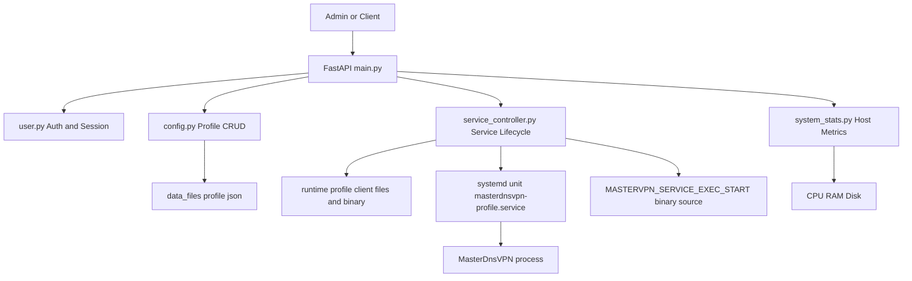

# MasterVPN API Backend

FastAPI backend for managing VPN client profiles, runtime files, service lifecycle, authentication, and basic system statistics.

## Tech Stack

- Python 3.10+
- FastAPI
- Pydantic
- Uvicorn
- python-dotenv
- systemd integration for service control

Dependencies: [requirements.txt](requirements.txt)

---

## Project Structure

- App entrypoint: [main.py](main.py)
- Auth routes and token/session logic: [user.py](user.py)
- Profile/config CRUD: [config.py](config.py)
- Service lifecycle management: [service_controller.py](service_controller.py)
- Host resource stats: [system_stats.py](system_stats.py)
- Profile JSON files: [data_files/](data_files/)
- Runtime generated files per profile: [runtime/](runtime/)

---

## Quick Start

1. Create and activate virtual environment
2. Install dependencies
3. Generate app secret key
4. Configure environment variables
5. Run server

```bash
python -m venv .venv
source .venv/bin/activate
pip install -r requirements.txt
python main.py
```

Generate a secure key:

```bash
python -c "import secrets; print(secrets.token_urlsafe(32))"
```

Copy the output and update `SECRET_KEY` in `.env`:

```env
SECRET_KEY=<paste-output-here>
```

Default URL: `http://127.0.0.1:8000`

---

## Environment Variables

Core app:

- `HOST` (default: `0.0.0.0`)
- `PORT` (default: `8000`)
- `SECRET_KEY`
- `ADMIN_USERNAME` (default: `admin`)
- `ADMIN_PASSWORD` (default: `password`)
- `SESSION_COOKIE_NAME` (default: `masterweb_session`)
- `COOKIE_SECURE` (default: `false`)
- `COOKIE_SAMESITE` (default: `lax`)

Service/systemd related (used by [`ServiceController`](service_controller.py)):

- `MASTERVPN_SYSTEMD_DIR` (default: `/etc/systemd/system`)
- `MASTERVPN_SERVICE_NAME_PREFIX` (default: `masterdnsvpn`)
- `MASTERVPN_SERVICE_DESCRIPTION` (default: `MasterDnsVPN Client`)
- `MASTERVPN_SERVICE_WORKDIR` (default: `/root/master2`)
- `MASTERVPN_SERVICE_EXEC_START` (default: `/root/master2/MasterDnsVPN`)
- `MASTERVPN_SERVICE_USER` (default: `root`)

---

## API Overview

Registered routers in [`main.py`](main.py):

- User/auth router from [user.py](user.py)
- Config router (`/config`) from [config.py](config.py)
- Service router (`/service`) from [service_controller.py](service_controller.py)
- System stats router (`/system-stats`) from [system_stats.py](system_stats.py)

Utility endpoints:
- `GET /api/health`
- `GET /api/info`
- SPA/static fallback handlers in [`main.py`](main.py)

---

## Runtime + Service Flow

For a profile, [`ServiceController.generate_runtime_files`](service_controller.py) will:

1. Read profile JSON from [data_files/](data_files/)
2. Generate:
   - `client_config.toml`
   - `client_resolvers.txt`
3. Copy executable from `MASTERVPN_SERVICE_EXEC_START` into per-profile runtime dir
4. Build service unit content via [`ServiceController.build_unit_content`](service_controller.py)

Runtime artifacts are placed under [runtime/](runtime/).

---

## Notes

- [newmaster/MasterDnsVPN](newmaster/MasterDnsVPN) is a compiled binary artifact, not source code.
- Runtime executable path is controlled by `MASTERVPN_SERVICE_EXEC_START`.
- Production deployment should use a strong `SECRET_KEY` and non-default admin credentials.
- Service endpoints require a host with `systemctl` access and correct sudo/systemd permissions.

---

## Mermaid Diagrams

Project architecture and runtime flow:


