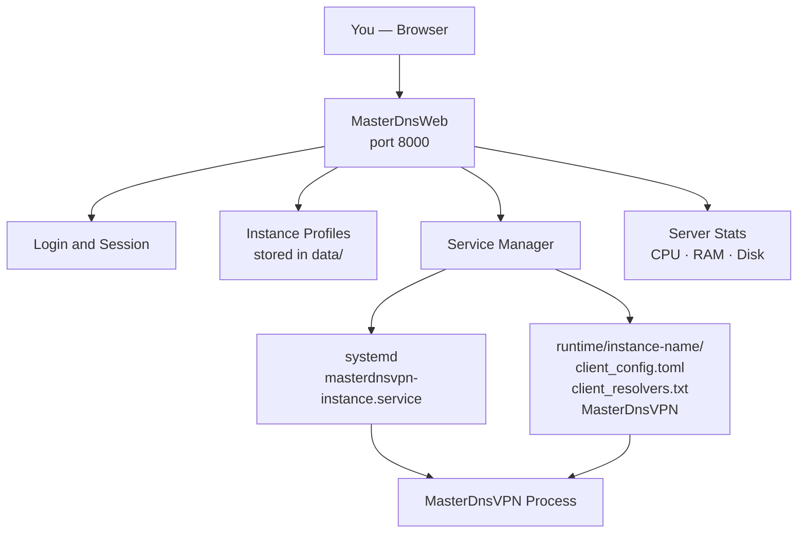

# MasterDnsWeb

[فارسی](README.fa.md)

MasterDnsWeb is a web panel for managing your **[MasterDnsVPN](https://github.com/masterking32/MasterDnsVPN)** instances on a Linux server.
You get a clean dashboard where you can create, configure, start, and stop VPN instances — all from your browser.


> This project is primarily designed for use on **Iran-based VPS servers**.

### Requirements

- **Ubuntu 20.04** or newer (other distros are not supported yet)
- The release archive: `MasterDnsWeb-linux-amd64.tar.gz`
- Root access (required to manage system services)

---

## Installation

### 1. Extract the archive

```bash
tar -xzf MasterDnsWeb-linux-amd64.tar.gz
cd MasterDnsWeb
```

You will see this folder:

```
MasterDnsWeb/
  MasterDnsWeb     ← the web panel (run this)
  MasterDnsVPN     ← the VPN client binary
  .env             ← your settings
```

### 2. Edit your settings

Open `.env` in any text editor:

```bash
nano .env
```

The only things you **must** change before starting:

```env
ADMIN_USERNAME=admin
ADMIN_PASSWORD=changeme   ← change this to something strong
```

Everything else already has safe defaults. Save and close.

### 3. Start the panel

```bash
sudo ./MasterDnsWeb
```

> **Why sudo?** The panel needs root access to create and control system services for each VPN instance.

The panel is now running. Open your browser and go to:

```
http://<your-server-ip>:8000
```

Log in with the username and password you set in `.env`.

---

## How to Keep It Running (Optional)

If you want the panel to start automatically when your server reboots, create a system service.

Run this command (replace `/root/MasterDnsWeb` with your actual folder path):

```bash
sudo nano /etc/systemd/system/masterdnsweb.service
```

Paste this inside:

```ini
[Unit]
Description=MasterDnsWeb Panel
After=network.target

[Service]
WorkingDirectory=/root/MasterDnsWeb
ExecStart=/root/MasterDnsWeb/MasterDnsWeb
Restart=always
RestartSec=5
User=root

[Install]
WantedBy=multi-user.target
```

Then run:

```bash
sudo systemctl daemon-reload
sudo systemctl enable masterdnsweb
sudo systemctl start masterdnsweb
```

---

## Using the Panel

### Creating an instance

1. Go to the **Instances** page
2. Click **New Instance** and give it a name
3. Click the instance to open its **Configuration** page

### Configuring an instance

Paste your `client_config.toml` content into the **Configuration** text box.
All fields from your config file are accepted — just paste the whole thing.

Add your resolver IPs in the **Resolvers** box (one per line), then click **Apply & Restart**.

### Starting / stopping

Use the **Start**, **Stop**, and **Restart** buttons on the Instances page.
Each instance runs as a separate system service in the background.

---

## Folder Layout After First Run

The panel creates these folders automatically next to the binary:

```
MasterDnsWeb/
  MasterDnsWeb           ← web panel binary
  MasterDnsVPN           ← VPN client binary
  .env                   ← your settings
  data/                  ← instance profiles (auto-created)
  runtime/
    my-instance/         ← working files per instance (auto-created)
      client_config.toml
      client_resolvers.txt
      MasterDnsVPN
```

---

## Settings Reference

All settings live in the `.env` file next to the binary.

| Setting | Default | Description |
|---|---|---|
| `ADMIN_USERNAME` | `admin` | Login username |
| `ADMIN_PASSWORD` | `changeme` | Login password — **change this** |
| `SECRET_KEY` | *(generated at build)* | Signs login sessions — do not share |
| `HOST` | `0.0.0.0` | Address the panel listens on |
| `PORT` | `8000` | Port the panel listens on |
| `COOKIE_SECURE` | `false` | Set to `true` if using HTTPS |
| `MASTERVPN_SERVICE_USER` | `root` | System user that runs VPN instances |
| `MASTERVPN_SERVICE_EXEC_START` | *(auto)* | Full path to `MasterDnsVPN` — only needed if it is not in the same folder |

---

## How It Works



---

## Troubleshooting

| Problem | What to do |
|---|---|
| **Panel won't start** | Make sure you run it with `sudo`. Root access is needed to manage services. |
| **Can't open it in the browser** | Check your firewall — port `8000` (or your custom `PORT`) must be open. |
| **"MasterDnsVPN binary was not found"** | Make sure `MasterDnsVPN` is in the same folder as `MasterDnsWeb`. Or set `MASTERVPN_SERVICE_EXEC_START` in `.env` to its full path. |
| **Instance won't start** | Open the instance in the panel and check the logs for details. |

---

## Special Thanks

A special thank you to [@shimafallah](https://github.com/shimafallah) for writing the backend.
